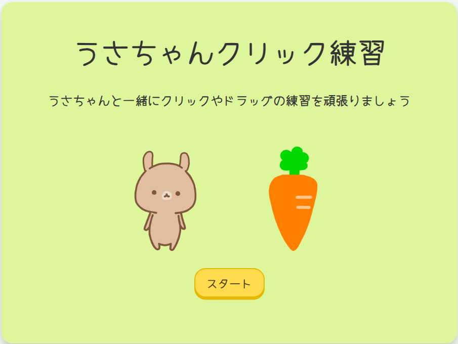
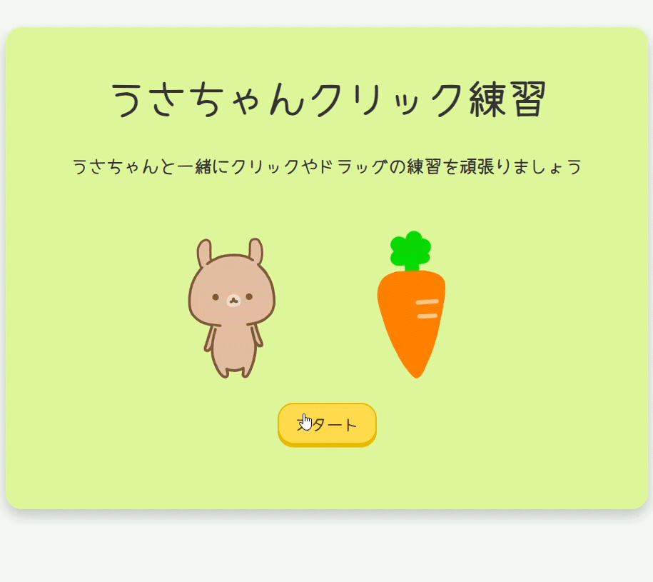

# うさちゃんクリック練習🐰🥕

<<<<<<< HEAD
うさちゃんのにんじんクリックハント🥕と名付けていましたが…  
使っていただく際にわかりやすいほうがいいかしら…とうさちゃんクリック練習と表示させました💻  
かわいくて気軽に楽しめる、Webブラウザ上で動作するクリック練習アプリです🖱  
慣れると当たり前となりますが、クリックやドラッグも初めての方にはとても難しい動作です。  
このアプリを使って遊んでいるうちにいつのまにか習得し、  
難しいな…楽しくないな…と思ってしまう方が少しでも減ったらいいなと願いを込めて制作しました✨  

## 🎮 操作の流れ

1. スタート画面  
「スタート」ボタンを押して、うさちゃんと一緒にクリック練習をはじめましょう！  
うさちゃんとにんじんのかわいいアニメーションがお出迎えいたします🐰  
2. ステージ1：にんじんもぐもぐ  
画面にランダムに並んだ5つのにんじんを、表示されている数字の順番にクリックしてください。  
（うさちゃんおなかがすいているから食べちゃうかも… ）  
順番どおりにクリックできたら次のステージへ進みます。  
3. ステージ2：にんじん収穫  
画面に10本のにんじんがランダムに配置されています。  
ダブルクリックでにんじんを収穫しましょう！全部収穫したら次へ♪  
4. ステージ3：かばんに入れよう  
にんじんをドラッグして、カバンの中に入れてください。  
3本全部入れられたらクリアです！  
5. ステージ4：うさちゃんお家へ帰る  
うさちゃんをドラッグしてお家まで連れて帰ってあげてください。  
道をはみ出さずにお家に帰れたらクリアです！  
（途中ドラッグは、放さないでくださいねうさちゃんが寂しがってクリアできません）  
6. クリア画面  
各ステージクリア後に表示される画面で「次へ」を押して次のステージに進んでください。  
7. 全クリア画面  
全部のステージをクリアしたら、がんばった自分をほめてあげてください✨  
8. 終わり画面  
最後にうさちゃんがお見送りしてくれるので「おわり」ボタンを押してブラウザを閉じてください  
=======
うさちゃんのにんじんクリックハント🥕と名付けていましたが…
使っていただく際にわかりやすいほうがいいかしら…と「うさちゃんクリック練習」と表示させました💻  
かわいくて気軽に楽しめる、Webブラウザ上で動作するクリック・ドラッグ練習アプリです🖱

## 🐣 背景と目的
慣れると当たり前となりますが、クリックやドラッグも初めての方にはとても難しい動作です。  
このアプリを使って遊んでいるうちにいつのまにか習得し、
難しいな…楽しくないな…と思ってしまう方が少しでも減ったらいいなと願いを込めて制作しました✨

## 🎮 操作の流れ

1. **スタート画面**
「スタート」ボタンを押して、うさちゃんと一緒にクリック練習をはじめましょう！  
うさちゃんとにんじんのかわいいアニメーションがお出迎えいたします🐰
2. **ステージ1：にんじんもぐもぐ**
画面にランダムに並んだ5つのにんじんを、表示されている数字の順番にクリックしてください。  
（うさちゃんおなかがすいているから食べちゃうかも… ）  
順番どおりにクリックできたら次のステージへ進みます。
3. **ステージ2：にんじん収穫**
画面に10本のにんじんがランダムに配置されています。  
ダブルクリックでにんじんを収穫しましょう！全部収穫したら次へ♪
4. **ステージ3：かばんに入れよう**
にんじんをドラッグして、カバンの中に入れてください。  
3本全部入れられたらクリアです！
5. **ステージ4：うさちゃんお家へ帰る**
うさちゃんをドラッグしてお家まで連れて帰ってあげてください。  
道をはみ出さずにお家に帰れたらクリアです！  
（途中ドラッグは、放さないでくださいね。うさちゃんが寂しがってクリアできません）
6. **クリア画面**
各ステージクリア後に表示される画面で「次へ」を押して次のステージに進んでください。
7. **全クリア画面**
全部のステージをクリアしたら、がんばった自分をほめてあげてください✨　
もう一度ステージ1から始めるか、終わるか選べます。
8. **終わり画面**
最後にうさちゃんがお見送りしてくれるので「おわり」ボタンを押してブラウザを閉じてください。
>>>>>>> 3e8b2f5 (2025.0522 README修正追加)

  

## 🎬 クリック練習デモ（GIF）

<<<<<<< HEAD
クリック練習のプレイデモです！どんな感じで遊べるか見てください。  
=======
クリック練習のプレイデモです！どんな感じで練習できるか見てください。  
>>>>>>> 3e8b2f5 (2025.0522 README修正追加)




## ⚙️ 技術スタック（Tech Stack）

- フロントエンド：HTML / CSS / JavaScript
- バックエンド：Python / Flask

## 🚀 実行方法

<<<<<<< HEAD
1. Pythonをインストールしてください。  
=======
1. **Pythonをインストールしてください。**  
2. **必要な魔法（パッケージ）をインストールしましょう！**
   ```bash
   pip install flask （ターミナルに入力してEnter）
>>>>>>> 3e8b2f5 (2025.0522 README修正追加)
2. **リポジトリをクローン**
   ```bash
   git clone https://github.com/erioonishi/usagi_click.git
3. **アプリを起動**
   ```bash
<<<<<<< HEAD
   python app.py
4. **サーバーが起動すると以下のURLが表示されます**
=======
   python app.py　（ターミナルでPythonファイルを実行する）
4. **サーバーが起動すると以下のURLがターミナルに表示されます**
>>>>>>> 3e8b2f5 (2025.0522 README修正追加)
   ```bash
   http://127.0.0.1:5000
5. **ブラウザで開く**
   ```bash
   http://127.0.0.1:5000 にアクセスすると、クリック練習を開始できます。

## 📂 ディレクトリ構成

```plaintext
usagi_click/
<<<<<<< HEAD
├── app.py                  # Flask アプリ本体
├── static/                 # CSSや画像などの静的ファイル
│   ├── style.css           # スタイルシート
│   └── images/
│       └── usachan.png     # うさちゃんの画像など（その他にんじんなど）
├── templates/              # HTMLファイルを格納（Flaskのルール）
│   ├── index.html          # スタート画面
│   ├── stage1.html         # ステージ1
│   ├── stage2.html         # ステージ2
│   ├── stage3.html         # ステージ3
│   ├── stage4.html         # ステージ4
│   ├── clear.html          # クリア画面
│   ├── allclear.html       # すべてクリアした画面
│   ├── continue.html       # もう一度挑戦するか選択できる画面
│   └── end.html            # 終了画面
├── .gitignore              # Git管理から除外するファイル設定
└── README.md               # プロジェクトの説明
```

## 📂 設計図（PDF）Web上での確認のため

- [PDFはこちらから見られます 📄](static/images/準備中です.pdf)
=======
├── app.py                   Flask アプリ本体
├── static/                  CSSや画像などの静的ファイル
│   ├── style.css            スタイルシート
│   └── images/
│       └── usachan.png      うさちゃんの画像など（その他にんじんなど）
├── templates/               HTMLファイルを格納（Flaskのルール）
│   ├── index.html           スタート画面
│   ├── stage1.html          ステージ1
│   ├── stage2.html          ステージ2
│   ├── stage3.html          ステージ3
│   ├── stage4.html          ステージ4
│   ├── clear.html           クリア画面
│   ├── allclear.html        すべてクリアした画面
│   ├── continue.html        もう一度挑戦するか選択できる画面
│   └── end.html             終了画面
├── .gitignore               Git管理から除外するファイル設定
└── README.md                プロジェクトの説明
```

## 📐 設計図（PDF）Web上での確認のため

- [準備中です!PDFはこちらから見られます 📄](static/images/準備中です.pdf)
>>>>>>> 3e8b2f5 (2025.0522 README修正追加)

## 💡 今後のアイデア

- もう少しゲーム数を増やす
- 音声をつける

## 🥺 ライセンス

このアプリは個人の学習目的で作成されたものであり、**商用利用を禁止**しています。  
その他の利用条件については、[LICENSE](./LICENSE) ファイルをご確認ください。  

## 🙌 クレジット

- フォント: Yomogi
- 開発: eri


