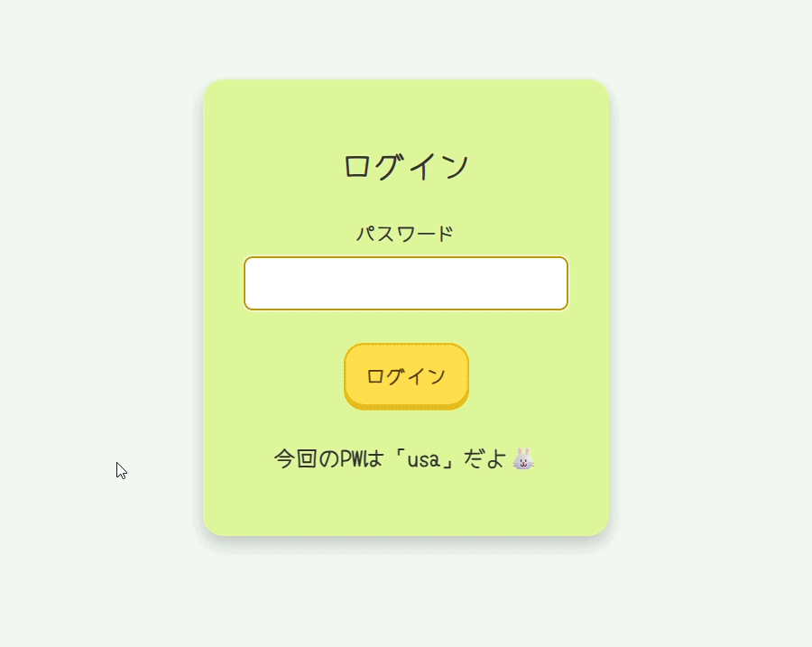

# うさちゃんクリック練習🐰🥕

うさちゃんのにんじんクリックハント🥕と名付けていましたが…
使っていただく際にわかりやすいほうがいいかしら…と「うさちゃんクリック練習」と表示させました💻  
かわいくて気軽に楽しめる、Webブラウザ上で動作するクリック・ドラッグ練習アプリです🖱

## 🐣 背景と目的
慣れると当たり前となりますが、クリックやドラッグも初めての方にはとても難しい動作です。  
このアプリを使って遊んでいるうちにいつのまにか習得し、
難しいな…楽しくないな…と思ってしまう方が少しでも減ったらいいなと願いを込めて制作しました✨

## 🎮 操作の流れ

1. **ログイン画面** 
お名前とスコアが個人情報として保存されるので、簡易なログイン画面を設置しました。
2. **スタート画面** 
※ここからは効果音が出てしまうので、出したくない場合はミュートしてください。
お名前を入力後、「スタート」ボタンを押して、うさちゃんと一緒にクリック練習をはじめましょう！  
うさちゃんとにんじんのかわいいアニメーションがお出迎えいたします🐰
3. **ステージ1：にんじんもぐもぐ**  
画面にランダムに並んだ5つのにんじんを、表示されている数字の順番にクリックしてください。  
（うさちゃんおなかがすいているから食べちゃうかも… ）  
順番どおりにクリックできたら次のステージへ進みます。
4. **ステージ2：にんじん収穫**  
画面に10本のにんじんがランダムに配置されています。  
ダブルクリックでにんじんを収穫しましょう！全部収穫したら次へ♪
5. **ステージ3：かばんに入れよう**  
にんじんをドラッグして、カバンの中に入れてください。  
3本全部入れられたらクリアです！
6. **ステージ4：うさちゃんお家へ帰る**  
うさちゃんをドラッグしてお家まで連れて帰ってあげてください。  
道をはみ出さずにお家に帰れたらクリアです！  
（途中ドラッグは、放さないでくださいね。うさちゃんが寂しがってクリアできません）
7. **クリア画面**  
各ステージクリア後に表示される画面で「次へ」を押して次のステージに進んでください。
（タイムランキングが表示されます）
8. **全クリア画面**  
全部のステージをクリアしたら、がんばった自分をほめてあげてください✨  
もう一度ステージ1から始めるか、終わるか選べます。
9. **終わり画面**  
最後にうさちゃんがお見送りしてくれるので「おわり」ボタンを押してブラウザを閉じてください。

  

## 🎬 クリック練習デモ（GIF）

クリック練習のプレイデモです！どんな感じで練習できるか見てください。  




## ⚙️ 技術スタック（Tech Stack）

- フロントエンド：HTML / CSS / JavaScript
- バックエンド：Python / Flask

## 🚀 実行方法

1. **Pythonをインストールしてください。**
2. **必要なパッケージをインストールしましょう！**
   ```bash
   pip install flask
2. **リポジトリをクローン**
   ```bash
   git clone https://github.com/erioonishi/usagi_click.git
3. **アプリを起動**
   ```bash
   python app.py
4. **サーバーが起動すると以下のURLがターミナルに表示されます**
   ```bash
   http://127.0.0.1:5000
5. **ブラウザで開く（アクセスすると、クリック練習を開始できます。）**
   ```bash
   http://127.0.0.1:5000 

## 📂 ディレクトリ構成

```plaintext
usagi_click/
├── app.py                   Flask アプリ本体
├── static/                  CSSや画像などの静的ファイル
│   ├── style.css            スタイルシート
│   └── images/
│       └── usachan.png      うさちゃんの画像など（その他にんじんや効果音など）
├── templates/               HTMLファイルを格納（Flaskのルール）
│   ├── login.html           ログイン画面
│   ├── index.html           スタート画面
│   ├── stage1.html          ステージ1
│   ├── stage2.html          ステージ2
│   ├── stage3.html          ステージ3
│   ├── stage4.html          ステージ4
│   ├── clear.html           クリア画面
│   ├── allclear.html        すべてクリアした画面
│   ├── continue.html        もう一度挑戦するか選択できる画面
│   └── end.html             終了画面
├── ranking.json             時間のランキング保存
├── .gitignore               Git管理から除外するファイル設定
└── README.md                プロジェクトの説明
```

## 📐 設計図（PDF）Web上での確認のため

- [PDFはこちらから見られます 📄](static/images/usagi.drawio.pdf)

## 💡 今後のアイデア

- もう少しゲーム数を増やす

## 😢 苦労した点

- 初めて使ったFlaskの記述に苦労しました。表示、遷移は楽に行えるものの、ランキングなどの記述は少し悩みました。
- ふんわりした色合いを使用しつつ、見やすさも大切にしたので少し苦労しました。

## 🥺 ライセンス

このアプリは個人の学習目的で作成されたものであり、**商用利用を禁止**しています。  
その他の利用条件については、[LICENSE](./LICENSE) ファイルをご確認ください。  

## 🙌 クレジット

- フォント: [Yomogi](https://fonts.google.com/specimen/Yomogi)（SIL Open Font License 1.1）
- 効果音: [効果音ラボ](https://soundeffect-lab.info/)（使用許諾に基づき利用）
- 音楽: [BGMer](http://bgmer.net)（使用許諾に基づき利用）
- 開発: eri

## 🎀 SpecialThanks

技術知識を授けてくださった講師の先生、５か月間の訓練生活を支えて下さった担任の先生、一緒に楽しく過ごしてくれた大切な仲間に心から感謝しています。


